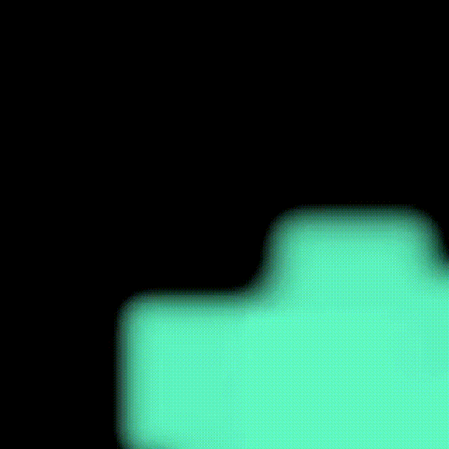

# 2D Fluid Simulation in Python

This project implements an interactive 2D fluid simulation based on the incompressible Navier–Stokes equations.  
It uses a combination of **semi-Lagrangian advection**, **implicit diffusion**, and an **FFT-based projection method** to enforce incompressibility.  
A Pygame UI allows real-time interaction, parameter tuning, and live visualization.

---

## Features

### 🔹 Numerical Core
- Semi-Lagrangian advection (stable for large time steps)
- Implicit diffusion step
- FFT-based pressure projection  
  Solves  
  \[
  \Delta p = \nabla \cdot u
  \]  
  in Fourier space with  
  \[
  \hat{p}(k) = \frac{\widehat{\nabla\cdot u}}{-|k|^2}
  \]
- Velocity correction via  
  \[
  u_{\text{new}} = u - \nabla p
  \]

### 🔹 Pygame Interface
- Adjustable simulation size and scaling
- Real-time parameter menu (viscosity, timestep, force strength, visualization mode)
- Interactive mouse input for forces and density
- Info overlay on hover
- Pause/reset functionality

---

## Usage

Run the simulation with:

```bash
python3 main.py
```

### Controls
- **Right Mouse Button** – Add velocity (forces)
- **Left Mouse Button** – Add density (“smoke”)
- **Hover over info icon** – Show info panel

---


## How It Works

### 1. Advection  
Semi-Lagrangian method using backtracing for numerical stability.

### 2. Diffusion  
Implicit step solved via iterative smoothing.

### 3. Pressure Projection  
Computes divergence, solves Poisson equation via FFTs:

```python
p_hat = div_hat / (-K_sq)
```

Ensures incompressibility.

### 4. Visualization  
- RGB color mapping of velocity magnitude  
- Vector field arrows  
- Adjustable resolution and scaling

---

## Simulation Examples





---

## License  
MIT License
